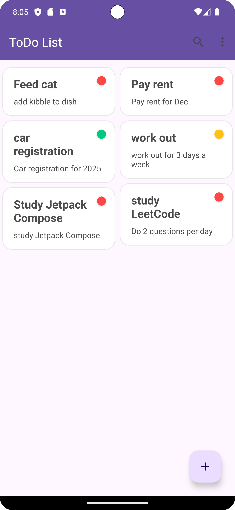
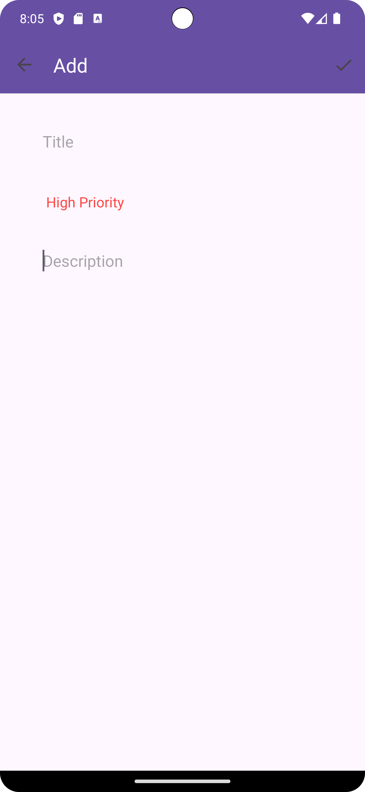

<p align="center">

<h1 align="center"> ToDo List App </h1>
<p align="center">
A robust ToDo list application for Android, built with modern Android development practices.
</p>
</p>

## Version Highlights

* **v1.0.0:** A complete ToDo list application featuring create, read, update, and delete functionality. Implements local data persistence using Room database and a modern MVVM architecture with a repository pattern.

## Table of Contents

1.  [Screenshots](#-screenshots)
1.  [Features](#-features)
2.  [Built With](#-built-with)
3.  [Architecture](#️-architecture)
4.  [Package Structure](#-package-structure)

## 📸 Screenshots

<table>
  <tr>
     <th>Main List View</th>
     <th>Add/Update View</th>
  </tr>
  <tr>
    <td>
      <p align="center">
  
</p>
    </td>
    <td>
       <p align="center">
      
</p>
    </td>
  </tr>
 </table>


## 🌟 Features

* **Add ToDo Items:** Create new tasks with a title, description, and priority level (High, Medium, Low).
* **View ToDo Items:** Display all tasks in a list.
* **Update ToDo Items:** Edit existing tasks.
* **Delete ToDo Items:** Remove individual items with a swipe gesture or delete all items at once.
* **Search Functionality:** Search through your ToDo list by title.
* **Sort by Priority:** Sort the list by high or low priority.
* **Local Persistence:** Data is saved locally using a Room database.

---

## 🛠 Built With

* [**Kotlin**](https://kotlinlang.org/) - The official programming language for Android development.
* [**Android Architecture Components**](https://developer.android.com/topic/libraries/architecture) - A collection of libraries that help you design robust, testable, and maintainable apps:
    * **LiveData**
    * **ViewModel**
    * **Room**
    * **Navigation Component**
* [**Hilt**](https://developer.android.com/training/dependency-injection/hilt-android) - A dependency injection library for Android.
* **Coroutines** - For asynchronous programming.
* **Data Binding** - Binds UI components in layouts to data sources declaratively.

---

## 🏛️ Architecture

This app follows the **MVVM (Model-View-ViewModel)** architectural pattern. The data layer is structured using a **Repository Pattern**, providing a clean and maintainable way to manage data from a single source of truth (the Room database). This separation of concerns ensures that the UI is isolated from the data logic, making the app more robust and testable.

---

## 📦 Package Structure
```
com.example.todo_xml/         # Root Package
├── data/                                  # Data handling layer
│   ├── models/                            # Data classes
│   ├── repository/                        # ToDoRepository implementation
│   ├── viewmodel/                         # ToDoViewModel
│   ├── Converter.kt                        # Room TypeConverter
│   ├── ToDoDao.kt                           # Room DAO
│   └── ToDoDatabase.kt                      # Room Database
│
├── di/                                    # Dependency Injection modules
│   └── HiltModules.kt                      # Hilt modules
│
├── fragments/                              # UI layer (Fragments)
│   ├── add/                                 # AddFragment
│   ├── list/                                # ListFragment and related classes
│   └── update/                              # UpdateFragment
│
└── utils/                                   # Utility classes
   └── Utils.kt                             # Helper functions
```
---

## 📧 Contact

You can reach me via:

[](https://www.linkedin.com/in/timothysliu/) [](mailto:timo9036@hotmail.com)
